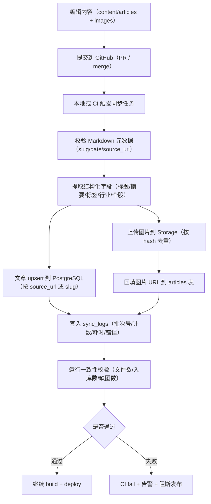

# 后端开发方案 V1（审查版）

## 1. 目标与边界

### 1.1 目标

- 将当前项目从“前端 + localStorage + Markdown 文件内容”升级为“前端 + Supabase 后端 + PostgreSQL 主库 + Storage 文件存储”。
- 在不破坏现有页面风格和交互的前提下，优先上线账号体系与数据同步能力。

### 1.2 V1 范围（做什么）

- 用户认证与账号资料（头像、用户名、邮箱/手机号、时区）。
- 阅读状态同步（unread/read/favorite）。
- 批注/金句同步。
- 文章库结构化入库（系列、标签、行业、个股、摘要、封面、正文索引）。
- 列表筛选与搜索后端化（分页、关键词、标签多选、系列筛选等）。

### 1.3 V1 暂不做（不做什么）

- 实时行情流、交易功能、复杂风控引擎。
- 微服务拆分与多数据库混合架构。
- 过度复杂的推荐系统。

## 2. 技术选型（定案）

- 前端：保持 Next.js（现有架构不推翻）。
- 后端平台：Supabase（PostgreSQL + Auth + Storage + Edge Functions）。
- 数据库：PostgreSQL（主库，后续可扩展 FTS 与 pgvector）。
- 对象存储：Supabase Storage（封面与正文图片）。
- 权限：PostgreSQL RLS（按 user_id 控制私有数据访问）。
- 脚本与迁移：Supabase CLI + SQL migrations（Schema 变更统一走迁移）。

### 2.1 文章存储策略（GitHub 源 + DB 索引）

- 内容源（Source of Truth）：GitHub 仓库中的文章 Markdown 文件（`content/articles/**/*.md`）。
- 约束：内容同步任务仅以 `.md` 文件为输入，不对“仓库全部文件”做同步扫描。
- 图片处理：图片只按 Markdown 正文中的引用关系处理；未被 Markdown 引用的文件不进入内容同步流程。
- 运行时查询层：PostgreSQL（存结构化字段和检索索引，不替代 Markdown 源文件）。
- 同步方式：导入脚本按 `slug/source_url` 做 upsert，将 GitHub 内容增量同步到数据库。
- 回滚方式：内容回滚优先走 Git 历史版本，再触发一次增量同步。
- 目标：既保留 Git 的版本管理与可审计性，又获得数据库的筛选、搜索和性能优势。

## 3. 分阶段实施计划

## 阶段 0：范围冻结与方案确认（0.5 天）

### 步骤

- 冻结 V1 目标、边界与交付顺序。
- 确认环境策略：dev/prod 两套 Supabase 项目。
- 确认分支策略：main 稳定、feature 分支开发。

### 交付物

- 《V1 范围说明》与《实施排期》。

### 验收标准

- 产品与开发对“做/不做”一致。

## 阶段 1：基础设施搭建（1 天）

### 步骤

- 创建 Supabase dev/prod 项目。
- 初始化 Supabase CLI 与本地开发配置。
- 配置环境变量（前端 anon key、CI service role key 分离管理）。

### 交付物

- `.env.example`、Supabase 初始化目录、迁移目录。

### 验收标准

- 本地可连 dev 库并执行迁移。
- CI 可执行 migration check。

## 阶段 2：数据库模型与权限（2 天）

### 步骤

- 建表：
  - `profiles`
  - `articles`
  - `series`
  - `tags`、`industries`、`stocks`
  - `article_tags`、`article_industries`、`article_stocks`
  - `reading_states`
  - `annotations`
  - `sync_logs`
- 建索引：列表筛选、排序、全文检索相关索引。
- 编写 RLS：私有数据按用户隔离。

### 交付物

- 完整 SQL migrations。
- ERD（实体关系图）与 RLS 清单。

### 验收标准

- 测试账号 A 无法读取/修改账号 B 私有数据。
- 核心查询具备可接受性能。

## 阶段 3：内容入库流水线（2 天）

### 步骤

- 新增导入脚本：以 GitHub 中的 `content/articles/*.md` 作为唯一输入源同步到数据库。
- 统一图片路径处理（本地路径 -> Storage URL）。
- 设计增量导入策略（按 `source_url`/`slug` 去重 upsert）。
- 明确同步触发点：本地导入后触发 + CI 构建前触发（保证库内数据与主分支一致）。

### 交付物

- 全量导入命令 + 增量导入命令 + 导入报告。

### 验收标准

- 抽检 30 篇文章，标题/摘要/日期/标签/图片一致。

### 阶段 3 补充：同步流程图（GitHub -> DB/Storage）



### 阶段 3 补充：命令规范（本地 / CI）

> 说明：以下是 V1 计划新增的标准命令名，用于统一执行入口；具体实现会在阶段 3 落地。

#### 本地命令规范（开发者）

```bash
# 1) 校验文章元数据（已存在）
npm run validate:articles

# 2) 预演同步（新增，仅读取不写库）
npm run sync:content -- --target=dev --mode=incremental --dry-run

# 3) 执行同步（新增，写入 dev 库）
npm run sync:content -- --target=dev --mode=incremental

# 4) 一致性校验（新增，核对数量/缺图/脏数据）
npm run verify:content-sync -- --target=dev
```

#### CI 命令规范（发布流水线）

```bash
# 0) 安装依赖
npm ci

# 1) 文章校验
npm run validate:articles

# 2) 同步到数据库与存储（生产环境）
npm run sync:content -- --target=prod --mode=incremental --ci

# 3) 同步结果校验
npm run verify:content-sync -- --target=prod --ci

# 4) 构建静态站点
npm run build
```

#### 参数约定（统一）

- `--target=dev|prod`：目标环境，必须显式指定，避免误写生产。
- `--mode=incremental|full`：增量或全量；默认 `incremental`。
- `--dry-run`：预演，不落库、不上传，仅输出计划变更。
- `--ci`：CI 模式，遇到校验错误直接非 0 退出。
- `--batch-id=<id>`：可选，手动指定同步批次号，便于审计回放。

#### 失败处理约定

- 任一关键步骤失败（校验/入库/回填/一致性检查）即终止流水线。
- 失败批次必须写入 `sync_logs`，包含错误摘要、失败阶段、耗时。
- 生产同步失败时禁止进入 `build/deploy` 阶段。

## 阶段 4：认证与用户中心后端化（2 天）

### 步骤

- 接入 Supabase Auth（邮箱或手机号，先定一种主路径）。
- `/settings` 改为真实读写 `profiles`。
- 头像从本地改为 Storage 托管，并保持右上角头像联动。

### 交付物

- 登录流程、用户资料读写、头像上传链路。

### 验收标准

- A 设备修改资料后，B 设备登录同账号可见。

## 阶段 5：阅读状态与批注同步（2 天）

### 步骤

- `article-state:*`、`article-annotations:*` 从 localStorage 迁移到后端。
- 首次登录支持“本地数据导入账号”流程。
- 保留本地缓存兜底能力（断网/未登录情况下可读写临时状态）。

### 交付物

- 同步模块 + 冲突处理策略（时间戳优先）。

### 验收标准

- 多设备状态一致，导入后无重复、无明显丢失。

## 阶段 6：文章查询与筛选后端化（2 天）

### 步骤

- 列表查询切到数据库（分页、排序、关键词、标签多选、行业筛选、系列筛选）。
- 标签侧栏与文章标签联动改为数据库聚合。
- pin 无标题时自动生成标题并追加“（自动生成）”。

### 交付物

- 查询接口与统一查询层。

### 验收标准

- 现有筛选行为不回退。
- 页面响应速度优于当前版本。

## 阶段 7：搜索与性能优化（1.5 天）

### 步骤

- 接入 PostgreSQL Full Text Search（标题/摘要/正文）。
- 增加慢查询日志与关键链路监控。
- 为高频查询加缓存策略（短 TTL）。

### 交付物

- 搜索能力上线与性能报告（P95）。

### 验收标准

- 搜索与列表查询响应达到目标阈值。

## 阶段 8：灰度与上线（1 天）

### 步骤

- 预发回归测试：功能、权限、数据一致性。
- 灰度发布：小范围账号先用，观察 24 小时。
- 正式切流并保留回滚开关。

### 交付物

- 上线清单、回滚预案、运维说明。

### 验收标准

- 无 P0/P1 故障，关键路径稳定。

## 4. 里程碑与周期

- 开发总工期：约 12 个工作日。
- 缓冲期：1-2 天（风控、网络、迁移异常等不确定性）。
- 总计：约 2.5 周可完成 V1。

## 5. 风险与应对

- 风险：历史 Markdown 数据质量不一致。
  - 应对：导入前校验 + 导入报告 + 异常记录回滚。
- 风险：localStorage 与服务端数据冲突。
  - 应对：首次导入时固定冲突策略并可重试。
- 风险：图片路径与正文引用不一致。
  - 应对：导入阶段统一 rewrite，并生成缺图检测报告。

## 6. 需要业务方确认的决策

- 登录主路径：邮箱优先还是手机号优先。
- 首次同步策略：自动导入还是用户手动确认导入。
- 头像策略：是否全部迁移到 Storage（建议是）。
- 部署策略：前端继续静态托管，还是后续迁移到支持 SSR 的平台。
- 内容治理策略：是否确认“GitHub 文件为内容唯一真相源，数据库仅作运行时索引和查询层”。

## 7. 冻结需求（2026-03-02）

- 登录方式：同时支持邮箱与手机号（同一账号可绑定两者）。
- 首次登录数据导入：先检测本地是否存在可迁移数据；仅在“存在数据”时弹窗询问是否导入；无数据则不弹窗、不导入。
- 前端运行方式：本地开发继续使用本机运行（`npm run dev`）；线上部署方式与本地运行互不冲突。
- 内容同步范围：仅同步 GitHub 中的文章 Markdown（`content/articles/**/*.md`），不做全仓库文件同步。
- 同步与发布约束：当内容同步或一致性校验失败时，阻断发布流程。

## 8. V1 完成定义（Definition of Done）

- 用户可登录并维护个人资料（含头像和时区）。
- 阅读状态与批注可跨设备同步。
- 文章列表筛选和搜索由数据库驱动。
- 数据权限通过 RLS 验证。
- 关键链路有监控，具备可回滚上线流程。
