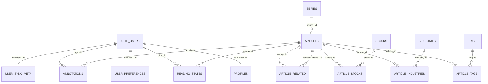

# 后端数据库设计 V1（阶段 2 交付）

## 1. 设计目标

- 用 PostgreSQL 承担运行时查询、筛选、搜索和用户同步状态。
- 保留 GitHub 中 `content/articles/**/*.md` 作为内容唯一真相源。
- 通过 RLS 保证用户私有数据隔离，公开内容可匿名读取。

## 2. ERD（核心）

## 3. 表清单（按域）

### 3.1 用户域

- `profiles`：头像、用户名、时区、展示手机号/邮箱。
- `user_preferences`：主题（light/dark）等偏好。
- `user_sync_meta`：首次导入后同步元信息（最后导入时间、导入条数）。
- `auth.users` 触发器：新用户注册后自动创建 `profiles`/`user_preferences`/`user_sync_meta`，并在邮箱或手机号变更时回写 `profiles`。

### 3.2 内容域

- `articles`：文章主表（标题、日期、摘要、正文 markdown、来源、content_path、检索向量）。
- `series`：系列维表。
- `tags` / `industries` / `stocks`：标签与分类维表。
- `article_tags` / `article_industries` / `article_stocks`：关联表。
- `article_related`：相关阅读映射。

### 3.3 用户阅读域

- `reading_states`：用户对文章状态（unread/read/favorite）。
- `annotations`：用户批注和金句（annotation/quote）。

### 3.4 运行审计域

- `sync_logs`：内容同步批次日志（批次号、结果、数量、错误、耗时）。

## 4. 关键字段与约束

- `articles.content_path`：唯一，且约束为 `content/articles/%`，确保来源仅为文章 md。
- `articles.source_url`：唯一索引（非空时唯一），用于增量 upsert 去重。
- `reading_states`：主键 `(user_id, article_id)`，保证每用户每文章单状态。
- `article_*` 关联表：复合主键避免重复映射。
- `articles.search_vector`：触发器维护，用于全文检索。

## 5. 权限模型（RLS）

### 5.1 私有数据（仅本人可读写）

- `profiles`
- `user_preferences`
- `user_sync_meta`
- `reading_states`
- `annotations`

策略：`auth.uid() = user_id`（或 `id`）的 select/insert/update/delete。

### 5.2 公共内容（所有用户可读）

- `articles`
- `series`
- `tags`
- `industries`
- `stocks`
- `article_tags`
- `article_industries`
- `article_stocks`
- `article_related`

策略：仅 `select using (true)`；不开放普通用户写入策略。

### 5.3 运维日志（仅服务角色）

- `sync_logs`

策略：启用 RLS，不给 anon/authenticated 放行策略，默认仅 service role 可访问。

## 6. 与当前前端的字段映射

- `localStorage:user-settings-profile-v1` -> `profiles`
- `localStorage:user-settings-sync-meta-v1` -> `user_sync_meta`
- `localStorage:article-state:*` -> `reading_states`
- `localStorage:article-annotations:*` -> `annotations`
- `content/articles/**/*.md` -> `articles + taxonomy + mappings`

## 7. 迁移文件位置

- `/Users/jianyuanchen/Desktop/Stock_Test/supabase/migrations/20260302133000_stage2_core_schema.sql`

## 8. 下一步（阶段 3）

- 实现 `sync:content` 真正入库：解析 md -> upsert 到 `articles` 与映射表。
- 解析正文图片引用并上传 Storage，回填 `cover_url`/正文资源 URL。
- 每批次写 `sync_logs`，失败阻断 CI 发布。
